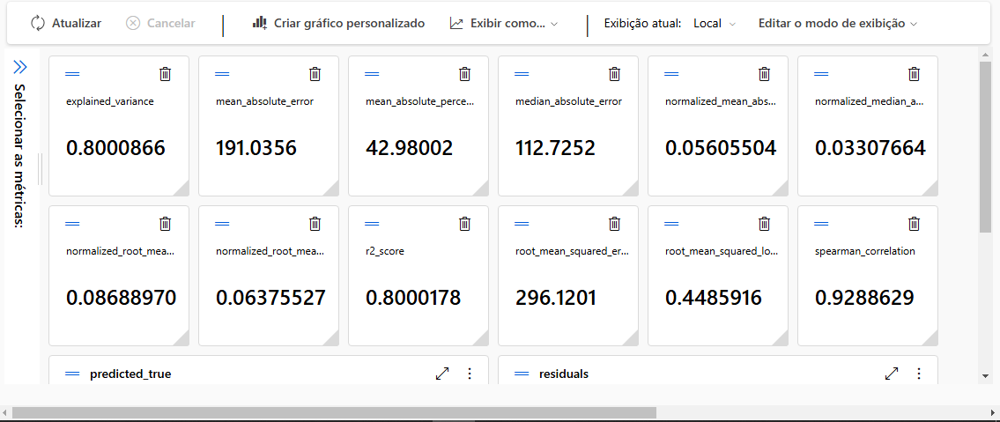
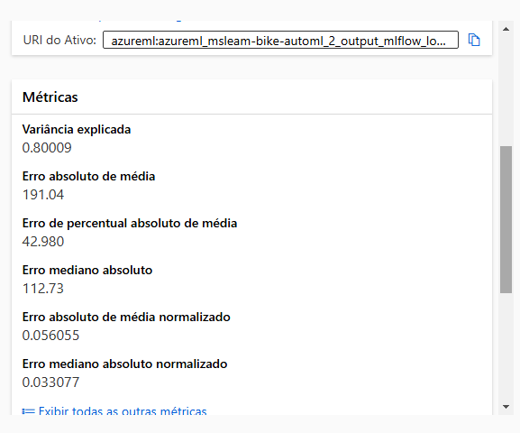
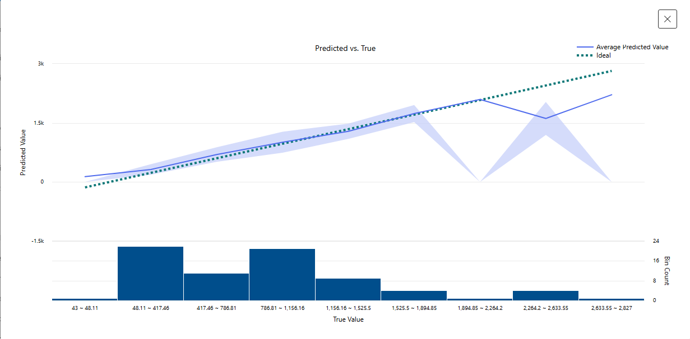
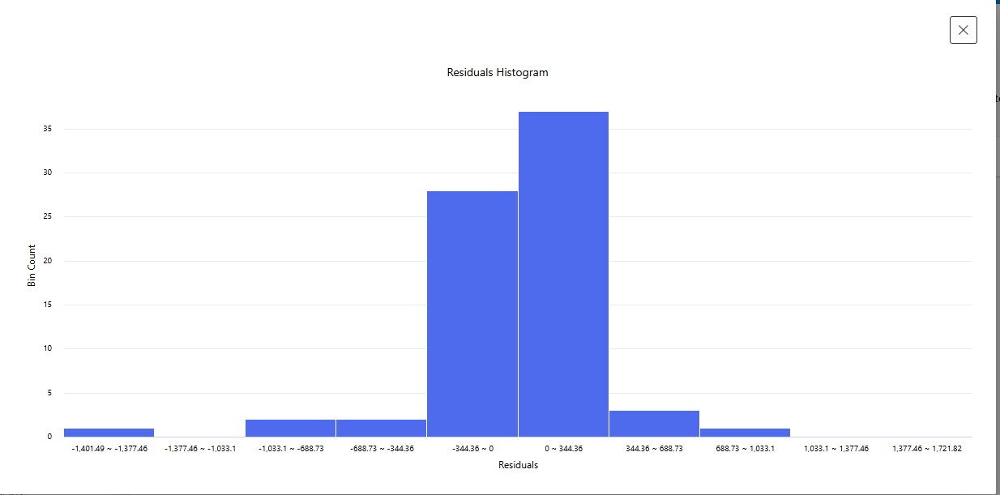

# Desafio 1 - Bootcamp Microsoft Fundamentos AI

## Trabalhando com Machine Learning no Azure ML

---

## Descrição

Este projeto é um laboratório de aprendizado em Azure Machine Learning, focado na previsão de aluguéis de bicicletas com base em dados históricos. O objetivo é aplicar técnicas de aprendizado de máquina para melhorar a precisão das previsões.

## Processo de Criação

O projeto foi desenvolvido usando o **Automated Machine Learning (AutoML)** do Azure em várias etapas principais:

1. **Configuração do trabalho AutoML**: Criação de um novo trabalho com configurações básicas.
2. **Conjunto de dados**: Upload de dados históricos de aluguéis, configurando armazenamento no Azure Blob.
3. **Definição da tarefa**: Configuração para regressão, seleção da coluna alvo e uso de modelos RandomForest e LightGBM.
4. **Computação**: Configuração de máquinas virtuais serverless.
5. **Execução**: Envio e monitoramento do trabalho.

O AutoML automatiza treinamento e avaliação, otimizando modelos de forma eficiente. O conjunto de dados inclui fatores sazonais e meteorológicos.

## Configuração do Workspace

1. Acesse o [Portal Azure](https://portal.azure.com) e crie um novo recurso **Azure Machine Learning** com:
   - **Grupo de recursos:** Novo ou existente.
   - **Região:** Próxima à sua localização.
   - **Configurações padrão:** Armazenamento, chave, e insights.
2. Após criar o recurso, acesse o Azure ML Studio via [https://ml.azure.com](https://ml.azure.com).

---

## Treinando o Modelo

1. Vá para **Automated ML** no Azure ML Studio e configure:
   - **Nome do trabalho:** mslearn-bike-automl
   - **Tipo de tarefa:** Regressão
   - **Conjunto de dados:** Dados históricos de aluguéis de bicicletas ([dados](https://aka.ms/bike-rentals)).
   - **Configurações de métricas e modelos:** Erro quadrático médio com RandomForest e LightGBM.
2. Envie o trabalho e aguarde a execução.

---

## Avaliando o Modelo

Após o treinamento, explore o modelo:

1. Acesse a guia "Visão Geral" e veja o resumo do melhor modelo.
   
2. Analise as métricas e gráficos de desempenho, como resíduos e valores previstos vs. reais.

---

## Implantação

1. Implante o modelo como serviço Web:
   - **Nome:** prever-alugueis
   - **Tipo de Computação:** Instância de Contêiner do Azure
   - **Autenticação:** Habilitada

### Métricas

---

**Previsto**

---

**Residuais**

